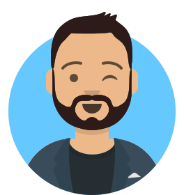
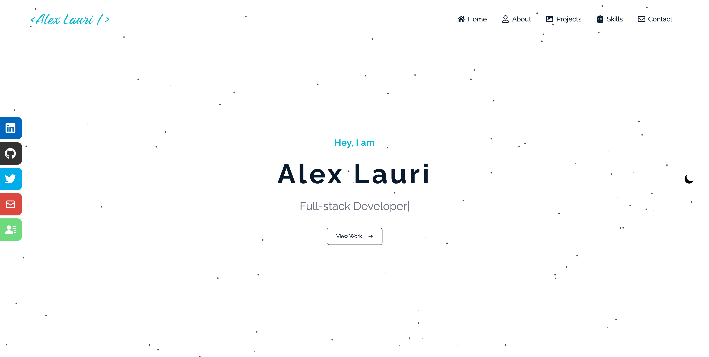
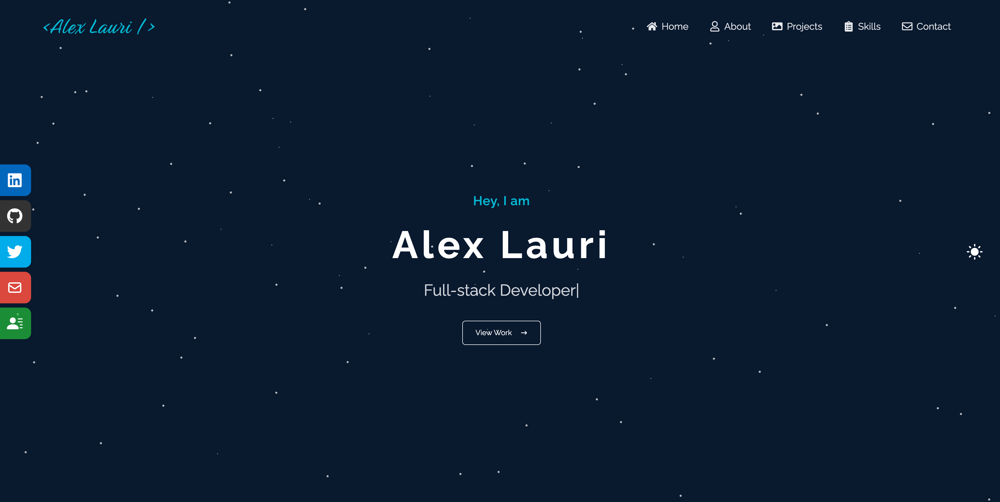
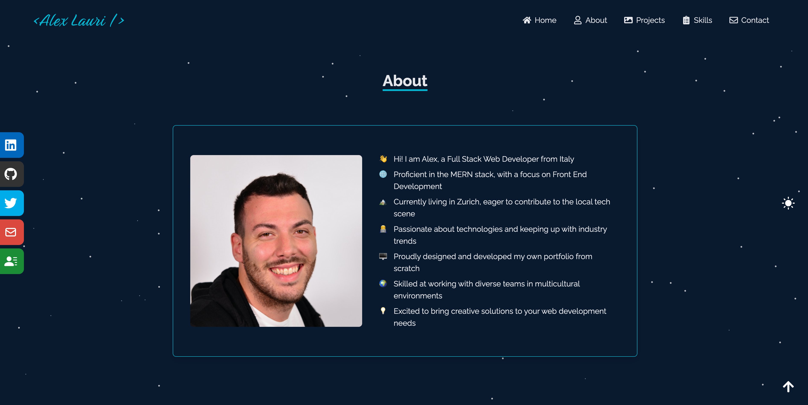
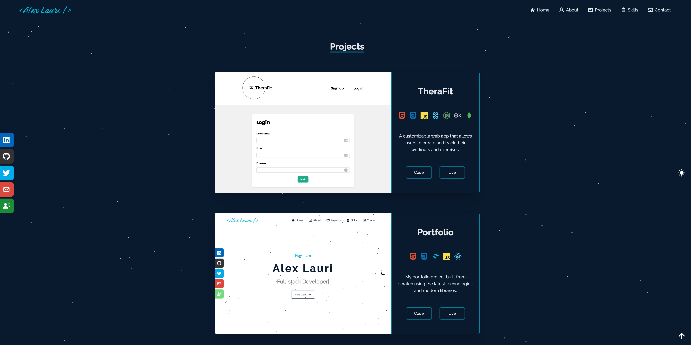
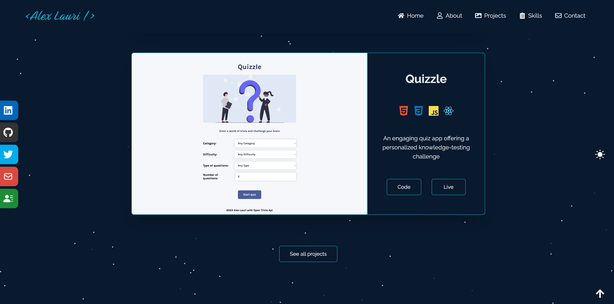

<a name="readme-top"></a>

<br />
<div align="center">

 # Personal Portfolio App

 
 
 <br />
 <br />
 
 <p align="center">
    Welcome to my personal portfolio app: A platform where I share my work, projects, and experiences as a developer, aiming to inspire others and connect with like-minded individuals in the tech industry.
 </p>
</div>


## Table of contents

- [Overview](#overview)
  - [Project Details](#project-details)
  - [Demo](#demo)
  - [Screenshot](#screenshot)
  - [Links](#links)
- [Process](#process)
  - [Technologies](#technologies)
  - [What I learned](#what-i-learned)
  - [Optimizations](#optimizations)
- [Getting started](#getting-started)
- [License](#license)

## Overview

### Project Details

My Personal Portfolio App is designed to showcase my projects, skills, and experiences as a developer. It includes a clean and modern user interface, making it easy for visitors to browse through my work and get to know me better.


 Features: 
- Responsive design
- Custom light/dark mode
- Customizable layout and theme
- About section with a brief introduction
- Skills section with a modern looking animation
- Project section with images, descriptions, and links
- Contact section with a form to submit
- A footer including social media icons


<p align="right">(<a href="#readme-top">back to top</a>)</p>

### Demo


<p align="right">(<a href="#readme-top">back to top</a>)</p>

### Screenshot

<details>
  <summary>Show Images</summary>
    <div align="center">
      
      
      
      
      
      
      
      </div>
</details>

<p align="right">(<a href="#readme-top">back to top</a>)</p>

### Links

- [Code Source](https://github.com/Alkxs/Personal-Portfolio)
- [Live Site](https://alexlauri-portfolio.netlify.app/)

<p align="right">(<a href="#readme-top">back to top</a>)</p>

## Process

### Technologies

- HTML
- CSS
- JavaScript
- React
- Vite
- React Libraries:
  - react-icons
  - react-scroll
  - react-toggle-dark-mode
  - react-tsparticles
  - react-router-dom
  - react-select
  - typewriter-effect

<p align="right">(<a href="#readme-top">back to top</a>)</p>

### What I learned

While developing my Personal Portfolio App, I gained valuable experience and a deeper understanding of various technical skills and concepts. Here are some key takeaways from this project:

React: I honed my skills in building a scalable and maintainable application using React, including functional components, hooks, and state management.

Vite: I learned to use Vite, a modern build tool and development server, to optimize the development process, offering a fast and efficient environment for building and testing my app.

React Libraries: I utilized various React libraries to enhance the application's functionality and appearance, such as react-icons, react-scroll, react-toggle-dark-mode, react-tsparticles, react-router-dom, react-select, and typewriter-effect.

Responsive Design: I focused on creating a fully responsive design to ensure that my portfolio app is accessible and visually appealing on a wide range of devices, including mobile phones, tablets, and desktops.

Customizable Layout and Theme: I implemented a custom light/dark mode toggle and customizable layout options, allowing users to personalize their browsing experience and adapt the interface to their preferences.

Modern User Interface: I designed a clean and modern user interface, making it easy for visitors to browse through my work and get to know me better. This included organizing content into easily navigable sections, incorporating eye-catching animations, and ensuring a consistent visual style throughout the app.

Contact Form: I integrated a contact form into the app, allowing visitors to get in touch with me directly through the website. This involved setting up the form's functionality and handling user input validation and submission.

Through the development of my Personal Portfolio App, I acquired a deeper understanding of various technical skills and concepts, which I can apply to future projects. This experience has contributed significantly to my growth as a developer and has prepared me to tackle new challenges in the ever-evolving world of web development.

<p align="right">(<a href="#readme-top">back to top</a>)</p>

### Optimizations

To further improve my Personal Portfolio App, there are several areas in which the application could be optimized. These improvements are divided into three main categories: design, functionality, and efficiency/code improvement.

#### Design

- Responsive Design: Ensure that the application's design is even more fully responsive and optimized for a wide range of devices, including mobile phones, tablets, and desktops. This would improve accessibility and user experience across different platforms.

- Improved User Interface: Streamline the user interface to make it more visually appealing and easier to navigate. This could include reorganizing menus, refining typography, and enhancing visual elements such as icons and images.

- Accessibility: Implement accessibility best practices, including proper use of semantic HTML and keyboard navigation, to make the application more inclusive and user-friendly for all users, including those with disabilities.

#### Functionality

- Blog Integration: Develop a built-in blog section, allowing me to share articles, tutorials, and insights about my work, the tech industry, and my personal experiences as a developer.

- Filtering Projects: Add filtering options to the project section, enabling users to view projects based on specific categories, technologies, or other criteria, making it easier for them to find relevant content.

#### Efficiency/Code Improvement

- Code Refactoring: Review and refactor the existing codebase to ensure best practices are followed, remove redundant code, and improve overall code maintainability and readability.

- Performance Optimization: Optimize the application's performance by implementing techniques such as lazy loading, caching, and minimizing API calls. This would result in faster load times and a smoother user experience.

- Testing & Debugging: Implement a comprehensive suite of automated tests to ensure the application is robust and free of bugs. This includes unit tests, integration tests, and end-to-end tests to cover all aspects of the application.

By focusing on these optimizations, my Personal Portfolio App can be further improved in terms of design, functionality, and efficiency, resulting in a more polished and user-friendly application that better showcases my work, projects, and experiences as a developer.

<p align="right">(<a href="#readme-top">back to top</a>)</p>


### Getting started

Before you set up the Personal Portfolio App on your local machine, ensure you have the following prerequisites:

- Node.js (version 14 or higher)
- npm (version 6 or higher) or yarn (version 1 or higher)

Once you have the prerequisites, follow these steps:

1. Fork the repository: Click the "Fork" button at the top-right corner of the Personal Portfolio App GitHub repository page to create a personal copy of the repository under your GitHub account.

2. Clone the repository: Clone the TheraFit repository using the following command:

```
git clone https://github.com/your_username/Personal-Portfolio.git

```

3. Install dependencies: Navigate to the project directory and run npm install or yarn install to install the required dependencies:

```
cd Personal-Portfolio
npm install

```

or

```
cd Personal-Portfolio
yarn install
```

4. Run the application: In the project directory, run the following command to start the application in development mode:


```
npm run dev

```

or

```
yarn dev

```

The application should now be running on http://localhost:5173. You can now start using the Personal Portfolio App and make any desired changes to the codebase.

<p align="right">(<a href="#readme-top">back to top</a>)</p>

### License

TheraFit is licensed under the MIT License. See the [LICENSE](LICENSE.txt) file for details.
